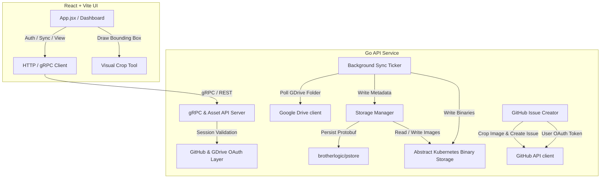

# Notes Management System - Implementation Plan

This document outlines the detailed architectural design and step-by-step Test-Driven Development (TDD) vertical slices to build the **Notes Management System**. It incorporates all decisions made during our Socratic grilling session.

---

## 1. Architectural Overview

The system consists of a Go backend and a React + Vite frontend running on Kubernetes.



---

## 2. Core Components

### Component A: Protobuf Schema (`proto/notes.proto`)
Defines the structure for notebooks, pages, and user configurations.
- **`UserConfig`**: Stores GitHub and Google Drive OAuth tokens (refreshed), selected Google Drive notes folder ID, and sync status.
- **`Notebook`**: Contains notebook metadata, linked GitHub project reference (`owner/repo`), and a list of pages.
- **`Page`**: Represents an individual note page with `id`, `page_number`, `drive_file_id` (Google Drive ID), `processed` (boolean), `created_time`, and `updated_time`.

### Component B: Persistence & Binary Storage (`internal/storage/`)
- Wraps `brotherlogic/pstore` to load and save protobuf structures (`UserConfig`, `Notebook`).
- Implements an abstract filesystem helper to read and write raw PDF/image note pages to a configured local directory (`/data/notebooks/`).

### Component C: Authentication Layer (`internal/api/auth.go`)
- **GitHub OAuth**: Standard OAuth login flow. On callback, saves the access token in a secure, HTTP-only cookie representing the session.
- **Google Drive OAuth**: Once authenticated via GitHub, the user can link their Google Drive. The backend exchanges the code for access & refresh tokens and stores them in the user's `UserConfig` in `pstore`.

### Component D: Google Drive Sync Loop (`internal/sync/`)
- A ticker-based background worker running every 5 minutes.
- Iterates over all active users in `pstore`.
- For each user: refreshes the Google Drive OAuth token, lists the configured Google Drive folder, downloads any new/changed notebook pages, parses them, updates the `Notebook` protobuf data, and writes the raw image files to the binary storage.

### Component E: Visual Crop & GitHub Issue Handler (`internal/api/issues.go`)
- Receives a request from the React frontend containing `page_id`, the bounding box crop coordinates (`x`, `y`, `width`, `height`), and issue title/body.
- Retrieves the raw notebook page from binary storage.
- Performs an in-memory image crop using Go's standard `image` package.
- Authenticates with the GitHub API using the current user's session OAuth token.
- Uploads the cropped image to GitHub (or attaches it in-line) and creates the issue in the notebook's linked repository.

---

## 3. TDD Vertical Slices (Issues Breakdown)

We will build this system using Matt Pocock's **TDD Skill**, implementing one thin vertical slice (tracer bullet) at a time, moving from **RED** to **GREEN** to **REFACTOR** for each feature.

```
┌─────────────────────────────────────────────────────────────┐
│                   TDD VERTICAL SLICES                       │
├─────────────────────────────────────────────────────────────┤
│ Slice 1: Proto Schemas & pstore Integration (Core Backend)  │
├──────────────────────────────┬──────────────────────────────┤
│ Slice 2: GitHub & GDrive OAuth Flow                         │
├──────────────────────────────┼──────────────────────────────┤
│ Slice 3: GDrive Scan & Periodic Sync Worker                 │
├──────────────────────────────┼──────────────────────────────┤
│ Slice 4: Page Viewer React UI & Asset API                   │
├──────────────────────────────┼──────────────────────────────┤
│ Slice 5: Bounding Box Crop & GitHub Issue Creation          │
├──────────────────────────────┼──────────────────────────────┤
│ Slice 6: Soft Archive Processing Workflow (End-to-End)      │
└──────────────────────────────┴──────────────────────────────┘
```

---

### Issue 1: Proto Schemas & `pstore` Integration (Core Backend)
* **Goal**: Define the protobuf schema and write TDD tests verifying we can store and retrieve notebook configurations and page metadata.
* **TDD Path**:
  - **Red**: Write a test verifying that calling `storage.SaveUserConfig` and `storage.GetUserConfig` persists a `UserConfig` with Google and GitHub tokens to `pstore`.
  - **Green**: Add `proto/notes.proto` schema, compile it using `protoc`, and write the minimum wrapper in `internal/storage/` to pass the test.
  - **Refactor**: Clean up the storage driver interface.

### Issue 2: GitHub & Google Drive OAuth Flow
* **Goal**: Implement secure OAuth endpoints and session management.
* **TDD Path**:
  - **Red**: Write a test for the `/login/github/callback` and `/link/gdrive/callback` handlers, mocking the OAuth code exchange and asserting that HTTP-only cookies are successfully set and tokens are stored in the user's config.
  - **Green**: Add the OAuth handlers in `internal/api/auth.go` using `golang.org/x/oauth2` packages.
  - **Refactor**: Abstract cookie token parsing into a shared middleware.

### Issue 3: Google Drive Scanning & Periodic Sync Loop
* **Goal**: Background worker downloads and syncs notebook images and page numbers.
* **TDD Path**:
  - **Red**: Write a test simulating a Google Drive directory list and download (mocking the GDrive client). Assert that a background sync run creates new `Page` records in `Notebook` and writes raw files to the binary storage.
  - **Green**: Build the background scanner logic in `internal/sync/` using `google.golang.org/api/drive/v3`.
  - **Refactor**: Optimize the scanning to check file modification times to prevent redundant downloads.

### Issue 4: Page Viewer React UI & Asset API
* **Goal**: Visualize notebook pages in a premium, responsive glassmorphism UI.
* **TDD Path**:
  - **Red**: Write frontend component tests (e.g. using Vitest / React Testing Library) asserting that the `NotebookDashboard` fetches notebooks, maps page numbers, and renders note images via the backend asset API `/api/pages/{page_id}/image`.
  - **Green**: Implement the static asset handler in the Go backend and build the React functional components with Outift typography, flex/grid layouts, and responsive styling.
  - **Refactor**: Add smooth hover state transitions and CSS animations for switching pages.

### Issue 5: Bounding Box Crop & GitHub Issue Creation
* **Goal**: Drawing crops in the UI generates a GitHub issue containing the cropped image.
* **TDD Path**:
  - **Red**: Write a backend integration test: given a note page image and crop coordinates (`x`, `y`, `w`, `h`), assert that the system outputs a correctly cropped image bytes and calls the GitHub API to create an issue.
  - **Green**: Write the cropping logic using `image.Image` sub-image extraction and wire up the GitHub REST API client using `google/go-github`.
  - **Refactor**: Optimize crop bounds validation to handle cases where bounding boxes overlap or go out of bounds.

### Issue 6: Soft Archive Processing Workflow (End-to-End)
* **Goal**: Allow marking a page as processed, hiding it by default but allowing viewing via a toggle.
* **TDD Path**:
  - **Red**: Write tests verifying that setting `processed = true` on a page hides it from the default `/api/notebooks` page listing unless `show_processed=true` is passed.
  - **Green**: Add the "processed" toggle handler in the backend and the "Show Processed" UI filter in the React frontend.
  - **Refactor**: Style the processed pages at the end of the list with a beautiful lower-opacity glass state and disabled crop actions.

### Issue 26: Production Hosting & Entrypoint
* **Goal**: Build a robust, production-grade `main.go` entrypoint and environment configuration under `/cmd/notes-server/` mapping routes, initializing gRPC database connections, managing sync worker loops, serving React frontend files, and supporting OS graceful shutdowns.
* **TDD Path**:
  - **Red**: Write unit tests in `cmd/notes-server/config_test.go` asserting that `LoadConfig` successfully loads environment variables and fails gracefully when required environment variables are absent.
  - **Green**: Implement config parsing in `cmd/notes-server/config.go` and implement the main server loop under `cmd/notes-server/main.go` supporting background synchronizers, multiplexed HTTP routing, and clean signal handling.
  - **Refactor**: Abstract fallback defaults and clean up standard output logs.

---

## 4. Proposed Changes for Issue 26

### Entrypoint Component

#### [NEW] [config.go](file:///workspaces/tasks/cmd/notes-server/config.go)
Helper struct and parser to load configurations cleanly from environment variables with safe fallbacks and validations.

#### [NEW] [config_test.go](file:///workspaces/tasks/cmd/notes-server/config_test.go)
Failing unit tests to assert correct config load and error validation under custom environments.

#### [NEW] [main.go](file:///workspaces/tasks/cmd/notes-server/main.go)
Production application entrypoint initializing database contexts, scheduling the background synchronization routine, binding API paths, static page servers, and handling SIGINT/SIGTERM gracefully.

---

## 5. Proposed Changes for Issue 34

### CI/CD Workflows

#### [NEW] [tagger.yml](file:///workspaces/tasks/.github/workflows/tagger.yml)
Auto-tagger workflow running on pushes to the `main` branch to calculate and create SemVer tags.

#### [NEW] [docker-build.yml](file:///workspaces/tasks/.github/workflows/docker-build.yml)
Multi-stage build & release workflow running on tag creations to push the release image directly to GitHub Container Registry (GHCR).

#### [MODIFY] [REQUIREMENTS.md](file:///workspaces/tasks/REQUIREMENTS.md)
Update the deployment manifest snippets to point to the official `ghcr.io/brotherlogic/notes:latest` (or tag version) repository image.

---

## 6. Verification Plan

### Automated Testing
- Validation: Ensure all YAML configurations conform to the GitHub Actions workflow schema.
- Run `go test -v ./...` to verify that GHA configuration files do not impact code compilations.
- Go: Run `go test -v ./cmd/notes-server/...` to test entrypoint config parsing.
- React: Run `npm run lint` and `npm run test` (if unit tests are configured) or execute `npm run build` to verify the production bundle compilation.

### Manual Verification
- Commit the workflows, push them to `main`, and verify in the GitHub Actions tab that the tagger runs, creates a tag (e.g. `v1.0.0`), and triggers the Docker builder to successfully build and push to `ghcr.io/brotherlogic/notes`.
- Execute `go run cmd/notes-server/main.go` in developer mode, verifying startup logs and environment safety traps.
- Deploy backend to local Kubernetes environment.
- Run frontend development server using `npm run dev`.
- Complete the GitHub + GDrive OAuth flow, specify a test folder in Google Drive, verify files are synced, draw a visual crop bounding box on the React UI, and confirm that an issue is successfully filed in the target GitHub repository with the cropped image.
